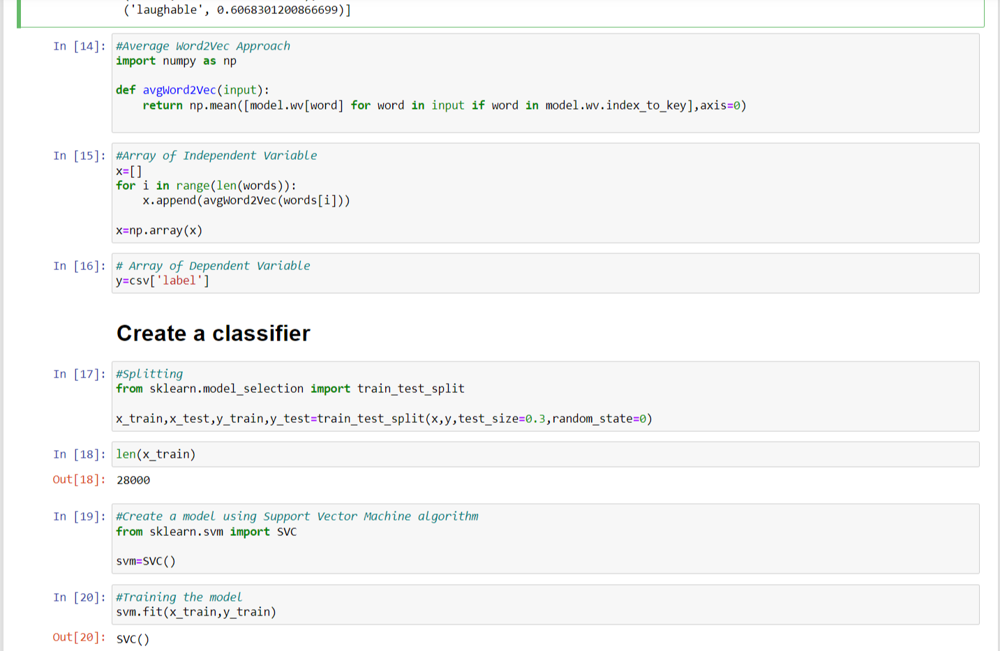
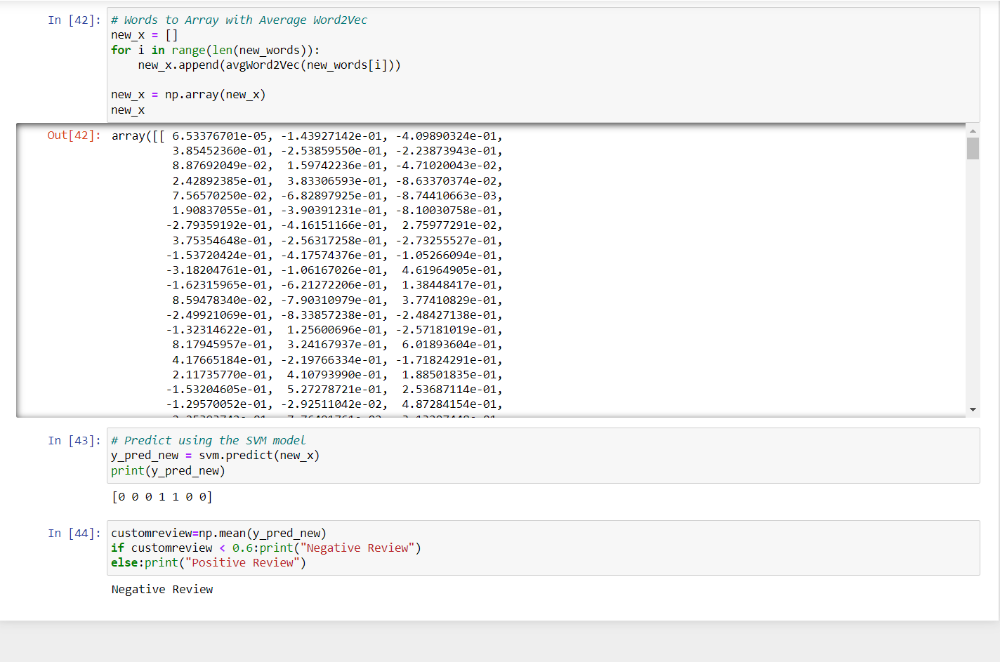

# [Dataset Link-> Click Here](https://www.kaggle.com/datasets/columbine/imdb-dataset-sentiment-analysis-in-csv-format?select=Train.csv)

## Approach
- There are over 40 thousand movie reviews in the dataset(train.csv) with labels 0 for negative review and 1 for positive review. 
- First I have removed the less important words and generate sentance tokens then word tokens.
- With Word2Vec from gensim library create a model and check if it can classify similar words.

- Then using AvgWord2Vec method converted the word into vectors/array to feed into the model.
- Next Train Test split 7:3 ratio.
- Now with Support Vector Machine algorithm create a classifier.

- Fit the model, Test and Check Accuracy.
- ### Now with custom input reviews the model can generate a response "Negative Review" or "Positive Review".

